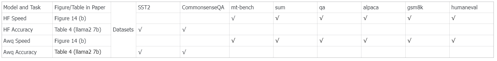

# SpecEE
## Setup
First setup the environments.

We need to setup three environments to evaluate SpecEE in huggingface and awq.
### Huggingface + SpecEE
```bash
cd SpecEE-cloud
conda create -n SpecEE python==3.10
conda activate SpecEE
pip install -r requirements.txt
```

### Raw awq
```bash
cd SpecEE-cloud
conda create -n awq python==3.10
conda activate awq
pip install -r requirements_awq.txt
```

### Awq + SpecEE
```bash
cd SpecEE-cloud
conda create -n specee_awq python==3.10
conda activate specee_awq
pip install -r requirements_awq.txt
cd AutoAWQ-0.2.6
pip install -e .
```

Second download the models needed.
```bash
huggingface-cli login
huggingface-cli download meta-llama/Llama-2-7b-chat-hf
huggingface-cli download TheBloke/Llama-2-7B-Chat-AWQ
huggingface-cli download yuhuili/EAGLE-llama2-chat-7B
```

## Evaluation
__AE code supports several data in our paper, including:__


### Huggingface + SpecEE
In our AE code, we can evaluate the speed and accuracy performance based on Huggingface.


Firstly, activate SpecEE environment.
```bash
conda activate SpecEE
```

The example command to evaluate speed.


```
CUDA_VISIBLE_DEVICES=0 python EEInference.py --base-model-path meta-llama/Llama-2-7b-chat-hf --draft-model-path yuhuili/EAGLE-llama2-chat-7B --dataset mt_bench --task speed --predictor-path [the local path of ./llama-7b] 
```

You can see speed evaluation results like:
```
SpecEE mt_bench tokens per second :   54.66483409619601
HF mt_bench tokens per second :   45.520089307858285
SpecEE acceleration ratio is:  1.2008947022597127
```
The example command to evaluate accuracy.
```
CUDA_VISIBLE_DEVICES=0 python EEInference.py --base-model-path meta-llama/Llama-2-7b-chat-hf --draft-model-path yuhuili/EAGLE-llama2-chat-7B --dataset sst2 --task accuracy --predictor-path [the local path of ./llama-7b]  
```
You can see accuracy evaluation results like:
```
SpecEE Model's accuracy on sst2 is:  0.8704128440366973
HF Model's accuracy on sst2 is:  0.8715596330275229
```
You can replace the model path information in run_hf_specee.sh to complete all AE experiments replication in one go.
```bash
./run_hf_specee.sh
```
### Awq + SpecEE
In our AE code, we can evaluate the speed and accuracy performance based on awq.
### Accuracy
Firstly, activate SpecEE environment.
```bash
conda activate SpecEE
```
The example command.
```
CUDA_VISIBLE_DEVICES=0 python EEInference_awq.py --base-model-path TheBloke/Llama-2-7B-Chat-AWQ --draft-model-path yuhuili/EAGLE-llama2-chat-7B --dataset commonsenseqa --task accuracy --predictor-path [the local path of ./llama-7b]  
```
### Speed
Firstly, activate awq environment.
```bash
conda activate awq
```
You can get all awq speed via:
```bash
CUDA_VISIBLE_DEVICES=0 python AwqInference.py --base-model-path TheBloke/Llama-2-7B-Chat-AWQ 
```

Next, activate specee_awq environment.
```bash
conda activate specee_awq
```
You can get all awq+specee speed via:
```bash
CUDA_VISIBLE_DEVICES=0 python AwqEEInference.py --base-model-path TheBloke/Llama-2-7B-Chat-AWQ --draft-model-path yuhuili/EAGLE-llama2-chat-7B
```
The speed evaluation results of awq and awq+specee are in raw_awq.json and specee_awq.json.

You can run calculate_awq_speedup.py to get speedup ratio of awq+specee.
```
> python calculate_awq_speedup.py
Speedup ratio:
mt_bench: 1.1266
sum: 1.1170
qa: 1.1410
alpaca: 1.1362
gsm8k: 1.1010
humaneval: 1.1162
AWQ+SpecEE Average speedup: 1.1230
```
